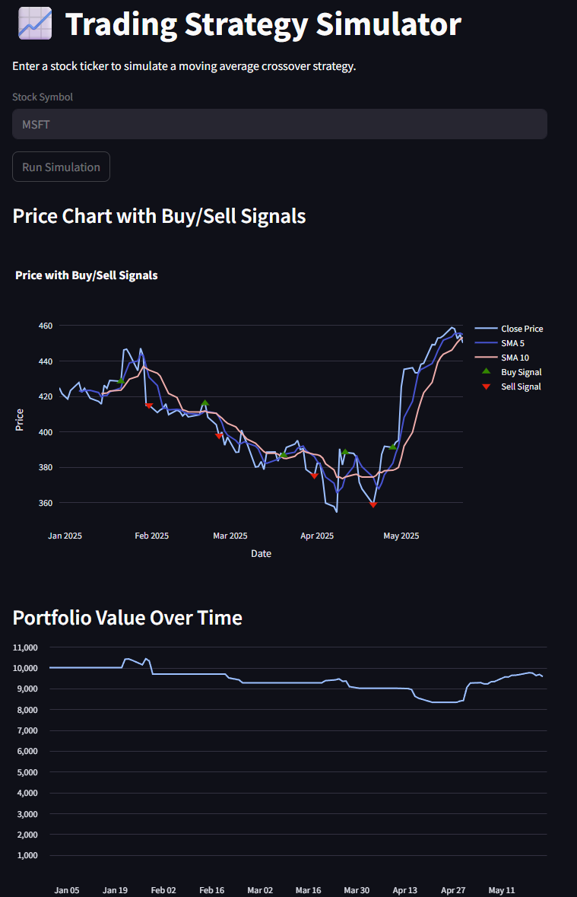

# Trading Strategy Simulator 🧠📈

This is a fully interactive trading strategy simulator built using Python, Streamlit, and Plotly.

## 🚀 Features

- **Real-time stock data** using Alpha Vantage API
- **Moving Average (SMA) Crossover Strategy** simulation
- **Buy/Sell signal visualization** on interactive price charts
- **Portfolio performance tracking**
- **SQLite database** for local historical data storage

## 🛠️ Technologies Used

- Python 3
- Streamlit (frontend)
- Plotly (interactive charts)
- SQLite (local database)
- Alpha Vantage API (market data)
- Pandas (data analysis)

## 🖥️ Running the App

1. Clone the repository:
   ```bash
   git clone https://github.com/your-username/trading-strategy-simulator.git
   cd trading-strategy-simulator
   ```

2. Create a virtual environment:
   ```bash
   python -m venv env
   source env/bin/activate  # or .\env\Scripts\activate on Windows
   ```

3. Install dependencies:
   ```bash
   pip install -r requirements.txt
   ```

4. Add your API key to a `.env` file:
   ```
   ALPHA_VANTAGE_KEY=your_api_key_here
   ```

5. Run the app:
   ```bash
   streamlit run app.py
   ```

## 📸 Screenshot



## 📄 License

MIT License. Feel free to use and modify for personal or educational use.

---

Built with 💙 by Mia Yuan
